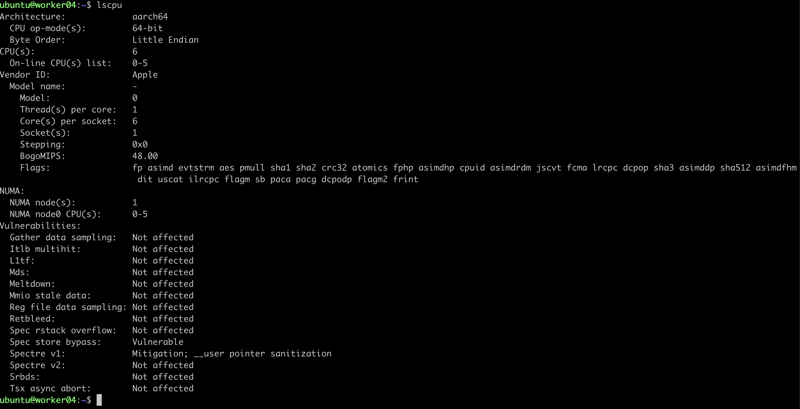
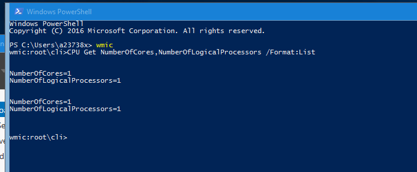

### cpu_cores

Scripts and files to understand physical to virtual cpu cores on a machine. 

## Linux

[Understanding Linux VM cpu cores - Physical/Virtual](https://github.com/cfkubo/cpu_cores/blob/main/cpu_cores_linux.md)

<p align="center">

</p>

## Windows

[Understanding Windows VM cpu cores - Physical/Virtual](https://github.com/cfkubo/cpu_cores/blob/main/cpu_cores_windows.md)

<p align="center">

</p>

## MAC
```
sysctl -a | grep -E "physical_cpu|logical_cpu|core_count"
```
Sample output:
```
$ sysctl -a | grep -E "physical_cpu|logical_cpu|core_count"
machdep.cpu.core_count: 10
```
